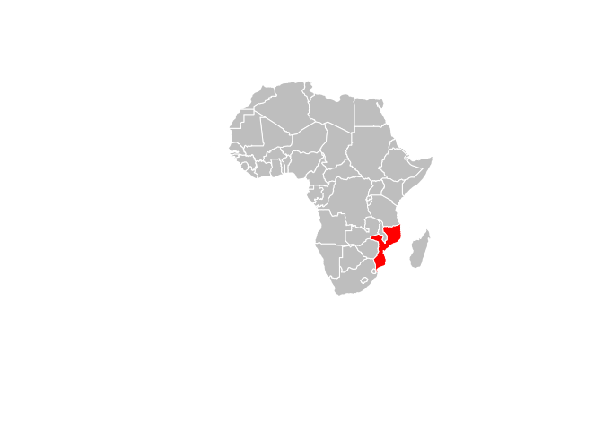
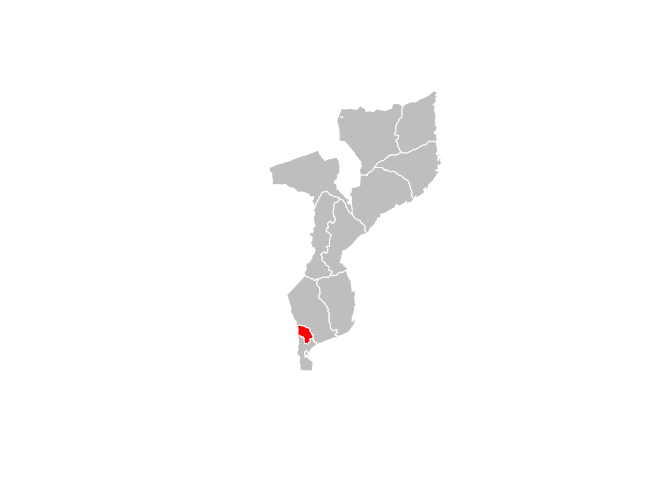
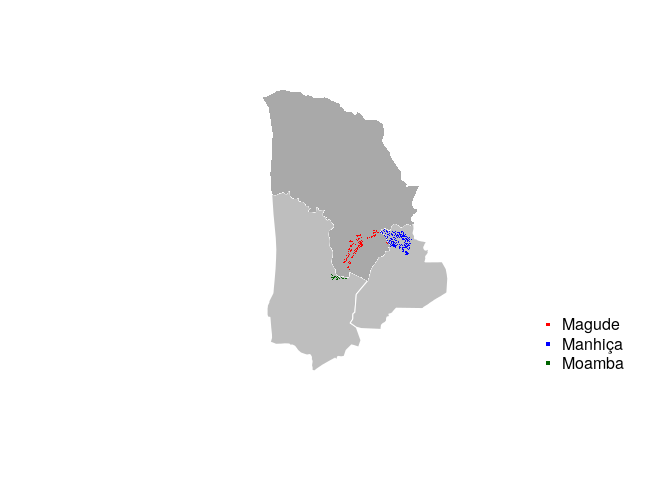
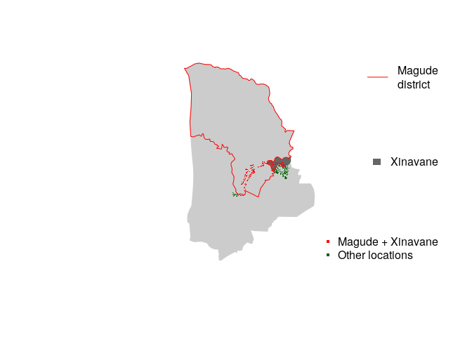
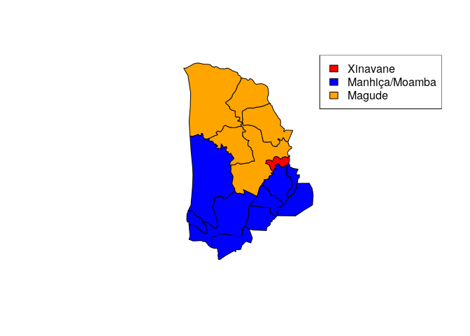
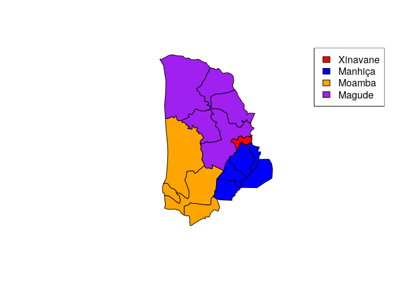

Map July 2019
================

``` r
# Libraries
library(tidyverse)
library(cism)
library(sp)
library(rgdal)
library(readxl)

# Get maps and combine
man <- cism::man3
mag <- cism::mag3
map <- rbind(man, mag)
moz <- cism::moz3
```

1)  elaborating 3 maps (I am attaching the maps included in the main
    impact paper, as reference, because I like them a lot), more
    specifically:

1.a. All africa, with mozambique coloured (similar to map \#1 from
impact paper)

``` r
library(rgdal)
afr <- readOGR('geo', 'Africa')
```

    OGR data source with driver: ESRI Shapefile 
    Source: "/home/joebrew/Documents/laiacirera/geo", layer: "Africa"
    with 762 features
    It has 3 fields

``` r
cols <- ifelse(afr@data$COUNTRY == 'Mozambique', 'red', 'grey')
plot(afr, col = cols, border = 'white')
```

<!-- -->

1.b. Map of southern Mozambique, with Magude district coloured (similar
to map \#2 from impact paper)

``` r
library(cism)
plot(moz1, col = 'grey', border = 'white')
plot(mag2, col = 'red', add = T, border = 'white')
```

<!-- -->

1.c. Map of Magude district, Moamba district and Manhiça district (only
drawing the districts “contornos”, not the neighbouring or localities
“contornos”) , with the workers locations plotted in (those
geolocations I already shared with you), and with a legend
indicating:Intervention district border (red line), workers in
intervention district (referring to all workers within Magude district)
-dots in red-, workers outside intervention district (referring to all
workers outside Magude district) -dots in another colour-.

``` r
library(readxl)
library(tidyverse)
# Read in the data sent from Laia
df <- read_excel('data/TONGAT_POINTS.xlsx')

# Convert to spatial
df_sp <- df %>% mutate(lng = x, lat = y)
coordinates(df_sp) <- ~x+y
proj4string(df_sp) <- proj4string(moz2)
# Get which district each point is in
map <- moz2
df_sp@data$district <- 
  map@data$NAME_2[over(df_sp, polygons(map))]
colx <- c('red', 'blue', 'darkgreen')
cols <- ifelse(df_sp@data$district == 'Magude', colx[1],
               ifelse(df_sp@data$district  == 'Manhiça', colx[2],
                      ifelse(df_sp@data$district  == 'Moamba', colx[3], NA)))


keep <- moz2[moz2@data$NAME_2 %in% c('Magude', 'Manhiça', 'Moamba'),]
plot(keep, col = 'grey', border = 'white')
plot(mag2, col = 'darkgrey', border = NA, add = T)
points(df_sp, col = cols, pch = '.')
legend('bottomright',
       legend = c('Magude', 'Manhiça', 'Moamba'),
       col = colx,
       pch = '.',
       pt.cex = 4,
       bty = 'n')
```

<!-- -->

2)  generating one new variable indicating closest distance to any point
    of Magude border, for the geolocations I previously shared with you.

<!-- end list -->

``` r
magude_border <- mag2
magude_border <- bound <- as(magude_border, 'SpatialLinesDataFrame')
magude_border <- spTransform(magude_border, CRS('+proj=laea +lat_0=5 +lon_0=20 +x_0=0 +y_0=0 +datum=WGS84 +units=m +no_defs'))
df_sp_proj <- spTransform(df_sp, CRS('+proj=laea +lat_0=5 +lon_0=20 +x_0=0 +y_0=0 +datum=WGS84 +units=m +no_defs'))
df_sp_proj@data$distance_to_magude_border <- NA
for(i in 1:nrow(df_sp)){
  this_location <- df_sp_proj[i,]
  distance <- rgeos::gDistance(this_location,
                               magude_border)
  df_sp_proj@data$distance_to_magude_border[i] <- distance
}
write_csv(df_sp_proj@data, 'distance_to_magude_border.csv')
```

1.d. Map of Magude district, Moamba district and Manhiça district (only
drawing the districts “contornos”, not the neighbouring or localities
“contornos”. only with one exception: draw “contornos” of Xinavane
locality) , with the workers locations plotted in (those geolocations I
already shared with you), and with a legend indicating:Intervention area
in Y2 (red line including all Magude and Xinavane), workers in
intervention area in Y2 (referring to all workers within Magude district
or Xinavane) -dots in red-, workers outside intervention area in Y2
(referring to all workers outside Magude and Xinavane) -dots in another
colour.

``` r
keep <- moz2[moz2@data$NAME_2 %in% c('Magude', 'Manhiça', 'Moamba'),]


x <- moz3@data$NAME_3[over(df_sp, polygons(moz3))]
df_sp@data$district2 <- x
df_sp@data$district2 <- ifelse(x %in% c('Magude', 'Xinavane'),
                               'Magude + Xinavane',
                               'Other locations')
colx <- c('red', 'darkgreen')
cols <- ifelse(df_sp@data$district2 == 'Magude + Xinavane', colx[1], colx[2])
xin <- man3[man3@data$NAME_3 == 'Xinavane',]

plot(keep, col = grey(0.8), border = grey(0.8))
plot(xin, col = grey(0.4), border = NA, add = T)
plot(mag2, col = NA, border = 'red', add = T)
points(df_sp, col = cols, pch = '.')
legend('bottomright',
       legend = c('Magude + Xinavane', 'Other locations'),
       col = colx,
       pch = '.',
       pt.cex = 4,
       bty = 'n')
legend('topright',
       lty = 1,
       col = 'red',
       legend = 'Magude\ndistrict', bty = 'n')

legend('right',
       fill = grey(0.4),
       legend = 'Xinavane', bty = 'n',
       border = NA)
```

<!-- -->

# Extra maps

## Xinavane and Magude, 3 colors -magude, xinavane, moamba+manhiça

``` r
man <- cism::man3
mag <- cism::mag3
moa <- moz3[moz3@data$NAME_2 %in% c('Moamba'),]
map <- rbind(man, mag, moa)
cols <- c('red', 'blue', 'orange')
colors <- ifelse(map@data$NAME_3 == 'Xinavane', cols[1],
               ifelse(map@data$NAME_2 %in% c('Manhiça', 'Moamba'), cols[2],
                      cols[3]))
plot(map, col = colors)
legend('topright',
       fill = cols,
       legend = c('Xinavane', 'Manhiça/Moamba', 'Magude'))
```

<!-- -->

2)  Xinavane, Magude, Moamba district i Manhiça district -exceptuant
    xinavane- amb colors diferents (total de 4 colors diferents).

<!-- end list -->

``` r
man <- cism::man3
mag <- cism::mag3
moa <- moz3[moz3@data$NAME_2 %in% c('Moamba'),]
map <- rbind(man, mag, moa)
cols <- c('red', 'blue', 'orange', 'purple')
colors <- ifelse(map@data$NAME_3 == 'Xinavane', cols[1],
               ifelse(map@data$NAME_2 == 'Manhiça', cols[2],
                      ifelse(map@data$NAME_2 == 'Moamba', cols[3], cols[4])))
plot(map, col = colors)
legend('topright',
       fill = cols,
       legend = c('Xinavane', 'Manhiça', 'Moamba', 'Magude'))
```

<!-- -->
