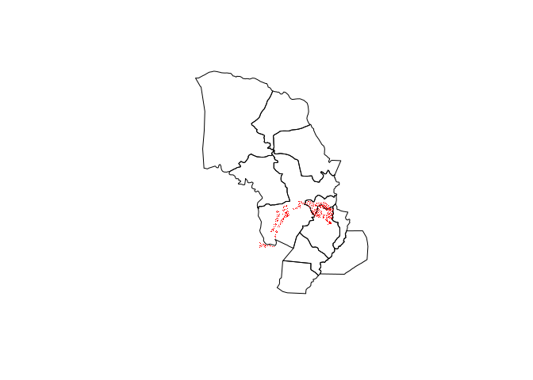
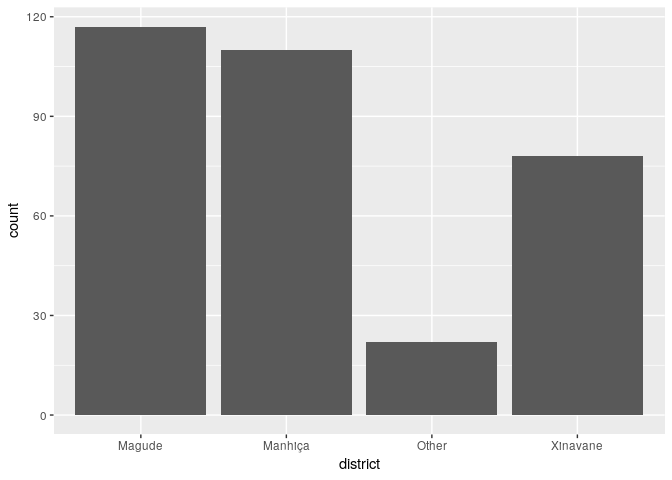
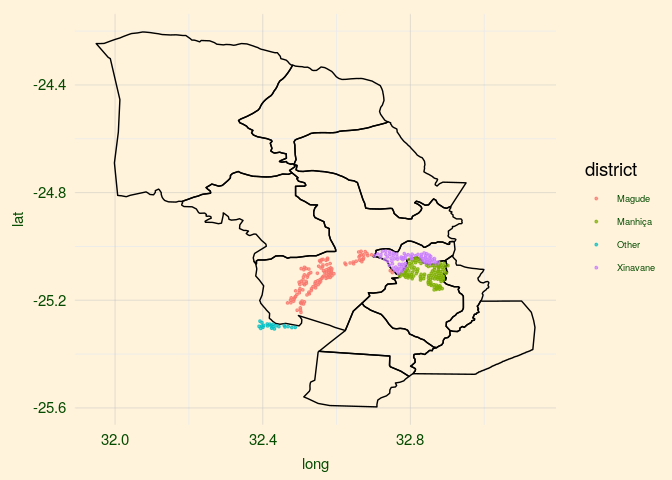

Xinavane mapping
================

``` r
# Libraries
library(tidyverse)
library(cism)
library(sp)
library(rgdal)
library(readxl)

# Get maps and combine
man <- cism::man3
mag <- cism::mag3
map <- rbind(man, mag)

# Plot the combined map
plot(map)

# Read in the data sent from Laia
df <- read_excel('data/TONGAT_POINTS.xlsx')

# Convert to spatial
df_sp <- df %>% mutate(lng = x, lat = y)
coordinates(df_sp) <- ~x+y
proj4string(df_sp) <- proj4string(map)

# Plot the map with the points
plot(map)
points(df_sp, pch = '.', col = 'red')
```



``` r
# Get which district each point is in
df_sp@data$district <- 
  map@data$NAME_3[over(df_sp, polygons(map))]

# Visualize
ggplot(data = df_sp@data,
       aes(x = district)) +
  geom_bar()
```


``` r
# Get a cleaner version of Manhica, Magude, Xinavane, or other
df_sp$district <- 
  ifelse(df_sp@data$district == '3 De Fevereiro' | df_sp@data$district == 'Ilha Josina Machel',
         'Manhiça',
         ifelse(
           is.na(df_sp@data$district),
         'Other',
         df_sp@data$district
         ))
df_sp@data$district[is.na(df_sp@data$district)] <- 'Other'

# Visualize again
ggplot(data = df_sp@data,
       aes(x = district)) +
  geom_bar()
```



``` r
# Get back to non-spatial
df <- df_sp@data

# Plot and color by district
map_ex <- fortify(map, id = 'OBJECTID')

ggplot() +
  geom_polygon(data = map_ex,
               aes(x = long,
                   y = lat,
                   group = group),
               fill = NA,
               color = 'black') +
  geom_point(data = df,
             aes(x = lng,
                 y = lat,
                 color = district),
             size = 0.7,
             alpha = 0.7) +
  theme_cism()
```


